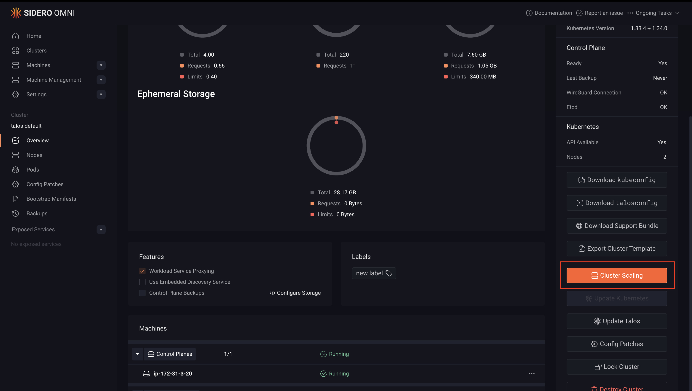
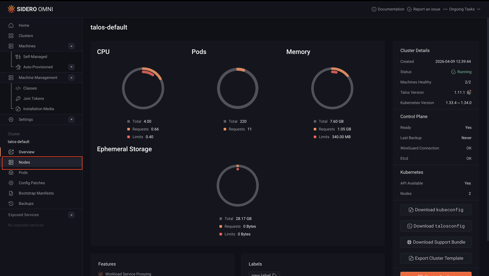

Scaling a cluster lets you add or remove nodes to match your workload requirements. In Omni, you can scale a cluster through the UI or by updating a cluster template. This guide covers both approaches.

<Note>When scaling control plane nodes, always maintain an odd number (1, 3, 5) to preserve etcd quorum. Removing a control plane node without maintaining quorum can make the cluster unavailable. For high availability, SideroLabs recommends running at least 3 control plane nodes.</Note>

## Scale up a cluster

Scaling up adds new nodes to an existing cluster. You can add nodes as control plane or worker nodes depending on your needs. Add a node as a **control plane** only if you need to increase fault tolerance or etcd quorum. For all other capacity increases, add nodes as **workers**.

<Tabs>
<Tab title="Cluster templates">

How you scale up depends on whether your cluster template uses a machine class or static machines.

### Using a machine class

Increase the `size` value in the `Workers` or `ControlPlane` document:

```yaml
kind: Workers
name: workers
machineClass:
  name: <machine-class-name>
  size: 3   # increase this number to add more machines
```

Then apply the updated template:

```bash
omnictl cluster template sync -f <your-template-file>.yaml
```

### Using static machines

Add the new machine UUID to the `ControlPlane` or `Workers` document:

To add a control plane node:

```yaml
kind: ControlPlane
machines:
  - <existing-controlplane-uuid>
  - <new-controlplane-uuid>
```

To add a worker node:

```yaml
kind: Workers
machines:
  - <existing-worker-uuid>
  - <new-worker-uuid>
```

Then apply the updated template:

```bash
omnictl cluster template sync -f <your-template-file>.yaml
```

For more information on cluster templates, see the [Cluster Template reference documentation](../../reference/cluster-templates).

</Tab>
<Tab title="UI">

1. Open **Clusters** from the left navigation and select the cluster you want to scale.
2. From the **Cluster Overview** tab, click **Cluster Scaling** in the right sidebar.



3. From the list of available machines, identify the machine or machines you want to add.
4. Click **ControlPlane** or **Worker** next to each machine to assign it a role.
5. Click **Add Machines** to apply the changes.

Once added, the new nodes will appear in the cluster and begin provisioning. You can monitor their status from the **Nodes** section in the left navigation.

</Tab>
</Tabs>

## Scale down a cluster

Scaling down removes nodes from a cluster. Removing a worker node is safe and non-disruptive to the cluster control plane. Removing a control plane node reduces etcd quorum, ensure the remaining number of control plane nodes is odd and sufficient to maintain a healthy cluster before proceeding.

> **Warning:** Destroying a node removes it from the cluster and wipes its configuration. This action cannot be undone. Ensure any workloads running on the node have been drained or rescheduled before proceeding.

<Tabs>
<Tab title="Cluster templates">

To remove a node from a cluster managed by a cluster template, remove the machine UUID from the relevant document in your template and sync it.

To remove a control plane node:

```yaml
kind: ControlPlane
machines:
  - <remaining-controlplane-uuid>   # remove the UUID of the node you want to delete
```

To remove a worker node:

```yaml
kind: Workers
machines:
  - <remaining-worker-uuid>   # remove the UUID of the node you want to delete
```

Apply the updated template:

```shell
omnictl cluster template sync -f <your-template-file>.yaml
```

For more information on cluster templates, see the [Cluster Template reference documentation](../../reference/cluster-templates).

</Tab>
<Tab title="UI">

1. Open **Clusters** from the left navigation and select the cluster you want to scale.
2. Click **Nodes** from the left navigation.



3. Find the node you want to remove, click the **...** menu to the right of the node, and select **Destroy**.


The node will be removed from the cluster and its configuration will be wiped. Monitor the remaining nodes from the **Nodes** section to confirm the cluster remains healthy after the operation.

</Tab>
</Tabs>
