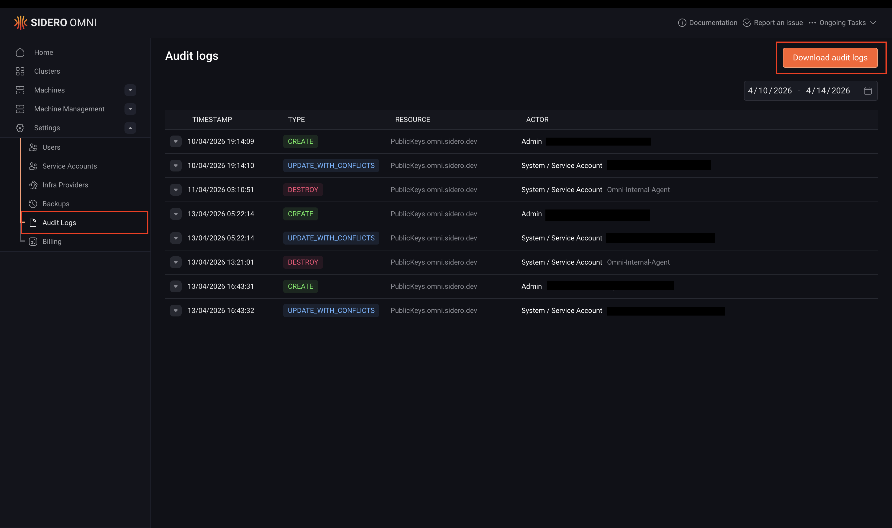

Omni records an audit log of all significant actions taken within an instance, including resource creation, updates, deletions, and access to Kubernetes and Talos clusters. 

Audit logs are useful for security reviews, compliance requirements, and investigating unexpected changes in your environment.

Each log entry captures who performed the action, when it occurred, what resource was affected, and session details such as IP address, user role, and email.

<Note>
Audit logs are enabled by default for Omni SaaS customers.
</Note>

## Enable audit logs (self-hosted)

Audit logging is disabled by default on self-hosted Omni instances. To enable audit logs, pass the `--audit-log-dir` flag when starting the Omni server, specifying the directory where log files should be stored:

```bash
docker run \
  ... \
  ghcr.io/siderolabs/omni:<tag> \
    --name=onprem-omni \
    ... \
    --audit-log-dir=/tmp/omni/audit-log
```

Omitting `--audit-log-dir` or setting it to an empty value disables audit logging.

### Log file storage and retention

Log files are written to the directory specified by `--audit-log-dir`. Each file covers one calendar day and is named using the format `<year>-<month>-<day>.jsonlog` — for example, `2024-08-12.jsonlog`.

Log files are retained for 30 days, including the current day. Files older than 30 days are deleted automatically.

## Access the audit log

Audit logs can be accessed through the Omni UI or via `omnictl`. Access requires an Admin role.

<Tabs>
<Tab title="CLI">

To stream the audit log to stdout, run:

```bash
omnictl audit-log
```

To retrieve logs for a specific date range, provide start and end dates in `YYYY-MM-DD` format:

```bash
omnictl audit-log <start-date> <end-date>
```

For example, to retrieve logs for the first week of August 2024:

```bash
omnictl audit-log 2024-08-01 2024-08-07
```

<Note>The CLI method is preferable for large audit logs or when piping output to a search or filtering tool such as `jq`, as it streams directly to stdout without buffering the entire log in memory.</Note>

</Tab>
<Tab title="UI">

Starting with Omni v1.7, you can open the audit log dashboard by navigating to **Settings > Audit logs**.



</Tab>
</Tabs>

## Audit log format

Audit logs are stored in [JSONL](https://jsonlines.org/) format, one JSON object per line, where each object represents a single audit event.

The following is an example log entry, formatted for readability:

```json
{
  "event_type": "create",
  "resource_type": "Clusters.omni.sidero.dev",
  "event_ts": 1723466435280,
  "event_data": {
    "cluster": {
      "id": "talos-default",
      "features": {},
      "kubernetes_version": "1.30.1",
      "talos_version": "1.7.4"
    },
    "session": {
      "user_agent": "Mozilla/5.0 (Macintosh; Intel Mac OS X 10_15_7) AppleWebKit/537.36 (KHTML, like Gecko) Chrome/127.0.0.0 Safari/537.36",
      "ip_address": "<snip>",
      "user_id": "fa02ea7c-6eb1-491e-b053-b5db63a4384f",
      "role": "Admin",
      "email": "user@example.com",
      "fingerprint": "0263efb13f3b5016507ec11ba71a96f5fced3a4d"
    }
  }
}
```

### Top-level fields

| Field | Description |
|---|---|
| `event_type` | The type of action that occurred. See [Event types](#event-types) below. |
| `resource_type` | The type of resource that was affected, e.g. `Clusters.omni.sidero.dev`. |
| `event_ts` | The timestamp of the event in milliseconds since Unix epoch. |
| `event_data` | A JSON object containing details about the event. See [Event data fields](#event-data-fields) below. |

### Event types

| Value | Description |
|---|---|
| `create` | A resource was created. |
| `update` | A resource was updated using the Update mechanism. |
| `update_with_conflicts` | A resource was updated using the UpdateWithConflicts mechanism. |
| `destroy` | A resource was destroyed. |
| `teardown` | A resource is being torn down and will be destroyed shortly. |
| `k8s_access` | A user accessed a Kubernetes cluster. |
| `talos_access` | A user accessed a Talos cluster. |

### Event data fields

The `event_data` object contains at least a `session` field, plus one or more resource-specific fields depending on the event type.

#### `session`

The `session` field describes the user session associated with the event.

| Field | Description |
|---|---|
| `user_agent` | The HTTP user agent. For actions performed internally by Omni, this will be `Omni-Internal-Agent` and all other session fields will be empty. |
| `ip_address` | The IP address of the client. Empty for `k8s_access` events. |
| `user_id` | The ID of the user who performed the action. |
| `role` | The role of the user at the time of the action. |
| `email` | The email address of the user. |
| `fingerprint` | The fingerprint of the user's public key. |

#### Resource-specific fields

The following fields may appear in `event_data` depending on the resource type involved:

| Field | Description |
|---|---|
| `new_user` | Details of a user that was created, edited, or deleted. |
| `machine` | Details of a machine that was created or destroyed. |
| `machine_labels` | Details of machine label changes. |
| `access_policy` | Details of an access policy change. |
| `cluster` | Details of a cluster change. |
| `machine_set` | Details of a machine set change. |
| `machine_set_node` | Details of a machine set node change. |
| `config_patch` | Details of a config patch change. |

#### `talos_access`

The `talos_access` field is present on `talos_access` events and contains:

| Field | Description |
|---|---|
| `full_method_name` | The full Talos API method name that was called. |
| `cluster_name` | The name of the cluster that was accessed. |
| `machine_ip` | The IP address of the node that was accessed. |

#### `k8s_access`

The `k8s_access` field is present on `k8s_access` events and contains:

| Field | Description |
|---|---|
| `full_method_name` | The full HTTP/2 method name called on the Kubernetes API. |
| `command` | The kubectl command that was run. |
| `body` | The request body, if any. |
| `kube_session` | The Kubernetes user session details. |
| `cluster_name` | The name of the cluster that was accessed. |
| `cluster_uuid` | The UUID of the cluster that was accessed. |

## Supported resources

The following resource types are recorded in the audit log:

| Resource type | Description |
|---|---|
| `PublicKeys.omni.sidero.dev` | Public key operations. |
| `Users.omni.sidero.dev` | User management operations. |
| `Identities.omni.sidero.dev` | Identity management operations. |
| `Machines.omni.sidero.dev` | Machine registration and removal. |
| `MachineLabels.omni.sidero.dev` | Machine label changes. |
| `AccessPolicies.omni.sidero.dev` | Access policy changes. |
| `Clusters.omni.sidero.dev` | Cluster creation, updates, and deletion. |
| `MachineSets.omni.sidero.dev` | Machine set changes. |
| `MachineSetNodes.omni.sidero.dev` | Machine set node changes. |
| `ConfigPatches.omni.sidero.dev` | Config patch changes. |

In addition to resource operations, Omni also logs `kubectl` access to Kubernetes clusters and direct access to Talos nodes via `talosctl`.

## Export audit logs

At this time, Omni does not provide a built-in integration for exporting audit logs to external logging platforms (such as SIEM or log aggregation systems).

For now, audit logs can be accessed via the CLI using `omnictl audit-log`, which allows you to stream logs to stdout and pipe them into external tools for processing or storage.

For example:

```bash
omnictl audit-log | jq .
```

This can be used to forward logs to other systems or integrate with existing tooling.

Support for direct export or integration with external log platforms may be added in a future release.
