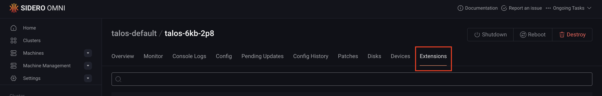
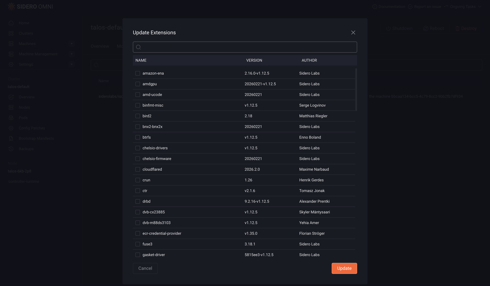

Talos Linux system extensions let you add extra functionality, such as drivers and services, to your machines. In Omni, you can manage these extensions either declaratively using cluster templates (CLI) or interactively through the UI.

Choose your preferred method below:

<Tabs>
  <Tab title="CLI">

    You can add Talos Linux system extensions to your machines by defining them in the machine configuration within your cluster template.

    Use the `systemExtensions` field in your cluster template to specify which extensions to install. For more details, see the [Cluster Templates reference documentation](../reference/cluster-templates).

    The code block below defines the configuration for a cluster named `example`, including system extensions for both control plane and worker machines.

    The worker machine is configured with NVIDIA-related extensions, including`nvidia-container-toolkit`, `nvidia-fabricmanager`, `nvidia-open-gpu-kernel-modules`, and `nonfree-kmod-nvidia`.

    ```yaml
    kind: Cluster
    name: example
    kubernetes:
      version: v1.29.1
    talos:
      version: v1.6.7
    systemExtensions:
      - siderolabs/hello-world-service
    ---
    kind: ControlPlane
    machines:
      - <control plane machine UUID>
    ---
    kind: Workers
    machines:
      - <worker machine UUID>
    ---
    kind: Machine
    name: <control plane machine UUID>
    ---
    kind: Machine
    name: <worker machine UUID>
    install:
      disk: /dev/<disk>
    systemExtensions:
      - siderolabs/nvidia-container-toolkit
      - siderolabs/nvidia-fabricmanager
      - siderolabs/nvidia-open-gpu-kernel-modules
      - siderolabs/nonfree-kmod-nvidia
    ```

    After defining your cluster template, validate it using:

    ```bash
    omnictl cluster template validate -f cluster.yaml
    ```

    If the validation succeeds, sync the template to apply the configuration to your Omni instance:

    ```bash
    omnictl cluster template sync -f cluster.yaml --verbose
    ```

    After syncing, the control plane will have the `hello-world-service` extension installed, while the worker machine will include the NVIDIA-related extensions.

  </Tab>

  <Tab title="UI" >

    To include system extensions into your Talos Omni image at build time through the Omni UI:

    1. Log in to your Omni dashboard.
    2. Click the **Download Installation Media** button to open the **Create New Media** wizard.
    3. On each page of the **Create New Media** wizard, select the appropriate options for your setup, then click **Next** to continue.

       The **Create New Media** wizard is identical to the [Image Factory](https://factory.talos.dev/) and it is split across multiple pages. Each page presents a different set of configuration options, such as architecture, hardware type, and Talos Linux version, that you can use to customize your Talos Omni image.

    4. On the **System Extensions** page, select the extensions you want to include in your image. Then click **Next** to continue with the setup.

    5. Select the appropriate boot option for your machine on the **Schematic Ready** page to download the Talos Omni image.

    6. Boot your machines using the downloaded image. The selected system extensions will already be installed.

    ### Modify system extensions

    You can also add or remove system extensions on an existing machine in a cluster:

    1. Select the cluster containing the target machine.

    2. Select the machine you want to modify.

    3. Open the **Extensions** tab.

      

    4. Click **Update Extensions**, then add or remove extensions as needed.

      

    5. Click **Update** to apply the changes.

  </Tab>

</Tabs>
