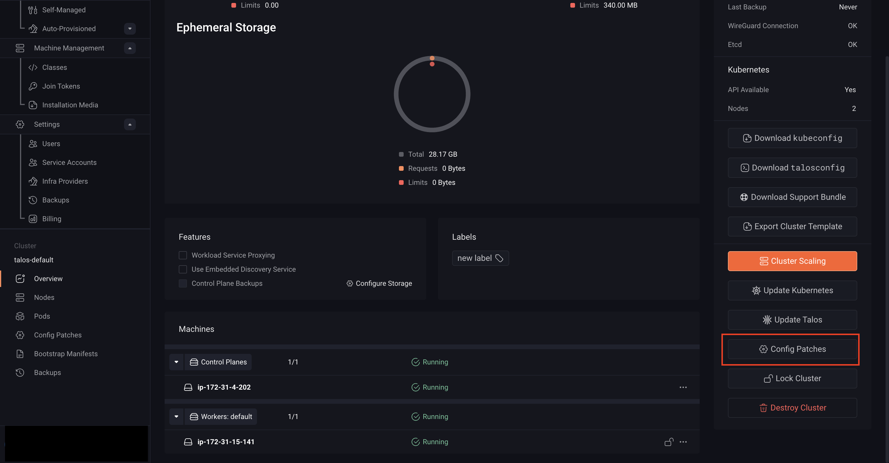
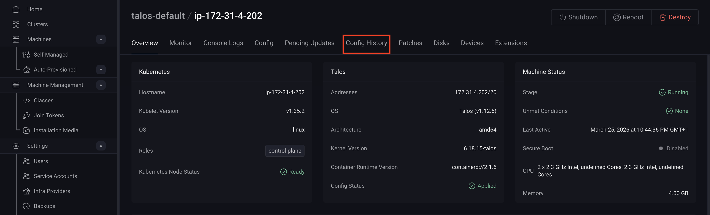

Omni allows you to create configuration patches and apply them to specific groups of machines within a cluster. You can target:

- All machines in a cluster
- Control plane nodes
- Worker nodes
- Individual machines

## Create and apply a configuration patch

To create and apply a configuration patch in Omni:

1. Select the **Clusters** tab in the left-hand menu.

2. Open the cluster menu (**⋯**) and select **Config Patches**.

   

   **Alternatively**, you can:
   - Open a specific cluster
   - Select **Config Patches** from the right-hand panel

   

3. Click **Create Patch**.

   

4. Select a target from the **Patch Target** dropdown.

   

   You can target the entire cluster, a group of machines (for example, all workers) or a specific machine.

5. Enter your configuration patch.

   

6. Click **Save** to create the patch.

Once saved, Omni applies the configuration to the selected machines.

## Review Configuration Changes

Starting with Omni v1.6.0, you can use the configuration diff view to review both pending and applied changes.

To view these changes:

1. Select a machine in your cluster
2. Navigate to the **Config History** tab

From here, you can inspect how configurations have changed over time and verify updates before or after they are applied.
