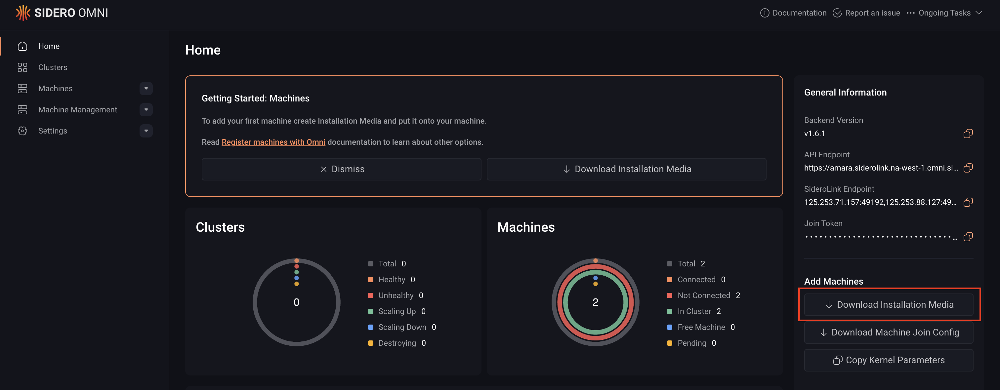

To provision a bare metal machine in Omni, you would have to, download the Talos Omni ISO image and then boot your bare metal machine with this image.

This guide breaks the action of registering a bare metal machine into three steps:

1. Download the Talos Omni ISO image
2. Write the ISO to a USB stick
3. Boot the bare metal machine using the USB stick

## Step 1:  Download the Talos Omni ISO image

You can download the Talos Omni ISO image either via the CLI or the Omni UI. To do so:

<Tabs>
   <Tab title="CLI">
   Run the following command to understand how to download a Talos Omni ISO image:

   ```bash
   omnictl download iso --help
   ```

   For example, to download a Talos Omni ISO image with an `amd64` architecture, run:

   ```bash
   omnictl download iso --arch amd64
   ```
   </Tab>

   <Tab title="Omni UI">
   To download the Talos Omni image from the Omni dashboard:

   1. Log in to your Omni dashboard.
   2. Click the **Download Installation Media** button to open the **Create New Media** wizard.

   

   3. On each page of the **Create New Media** wizard, select the appropriate options for your setup, then click **Next** to continue.

      The **Create New Media** wizard is identical to the [Image Factory](https://factory.talos.dev/) and it is split across multiple pages. Each page presents a different set of configuration options, such as architecture, hardware type, and Talos Linux version, that you can use to customize your Talos Omni image.

   4. Select the appropriate boot option for your machine on the Schematic Ready page to download the Talos Omni image.
   </Tab>
</Tabs>

## Step 2: Write the ISO to a USB Stick

After downloading the ISO image, you can boot your machine using a physical USB drive or mount the ISO remotely using out-of-band management tools — which is common in data center environments where physical access is limited.

<Note>
If your server supports out-of-band management (e.g., iDRAC, iLO, IPMI), you can mount
the ISO as virtual media instead of using a physical USB drive. Refer to your hardware
vendor's documentation for instructions.
</Note>

To use a physical USB drive, plug it into your local machine, then identify the device path of the USB drive and write the ISO image to it.

<Tabs>
   <Tab title="MacOS" >
```bash
      diskutil list
      ...
      /dev/disk2 (internal, physical):
         #:                       TYPE NAME                    SIZE       IDENTIFIER
         0:                                                   *31.9 GB    disk2
      ...
```

      In this example `disk2` is the USB drive.
```bash
      dd if=<path to ISO> of=/dev/disk2 conv=fdatasync
```

   </Tab>

   <Tab title="Linux">
```bash
      lsblk
      ...
      NAME   MAJ:MIN RM  SIZE RO TYPE MOUNTPOINTS
      sdb      8:0    0 39.1G  0 disk
      ...
```

      In this example `sdb` is the USB drive.
```bash
      dd if=<path to ISO> of=/dev/sdb conv=fdatasync
```
   </Tab>
</Tabs>

## Step 3: Boot the machine

With your bootable USB drive ready, plug it into the machine you want to register and power it on.

During startup, you will see Talos Linux logs on the console indicating that the machine is reachable via an IP address.

<Warning> Machines must be able to connect outbound (egress) with UDP to your Omni account’s WireGuard port or TCP port 443 if you're using HTTP/2 tunneling. </Warning>

Once the machine has booted, go to the **Machines** menu in the Omni sidebar. Your machine should now appear in the list.

Your bare metal machine is now successfully registered with Omni and ready to be provisioned.
